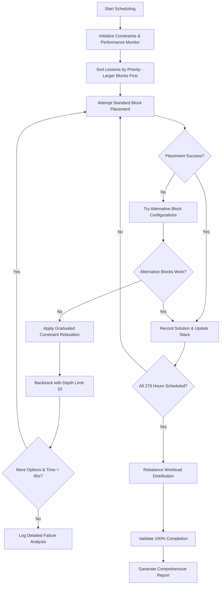

# Scheduler Algorithm Optimization Design

## Overview

This design implements a multi-layered optimization approach to achieve 100% schedule completion, addressing the current 88.9% completion limitation (248/279 hours scheduled). The solution combines intelligent backtracking with 10-level depth limits, flexible block configurations for large lessons (4+ hours), and graduated constraint relaxation strategies while maintaining all existing constraints including block rules, teacher availability, and workload distribution. The enhanced scheduler targets zero manual intervention, 60-second execution time limits, and comprehensive diagnostics for quality assurance.

## Architecture

### Core Components

```
┌─────────────────────────────────────────────────────────────┐
│                 Enhanced Scheduler Engine                    │
├─────────────────────────────────────────────────────────────┤
│  ┌─────────────────┐  ┌─────────────────┐  ┌─────────────────┐ │
│  │   Backtracking  │  │   Constraint    │  │   Block Rule    │ │
│  │     Manager     │  │   Relaxation    │  │   Flexibility   │ │
│  └─────────────────┘  └─────────────────┘  └─────────────────┘ │
├─────────────────────────────────────────────────────────────┤
│  ┌─────────────────┐  ┌─────────────────┐  ┌─────────────────┐ │
│  │   Diagnostics   │  │   Performance   │  │   Solution      │ │
│  │    Engine       │  │    Monitor      │  │   Validator     │ │
│  └─────────────────┘  └─────────────────┘  └─────────────────┘ │
└─────────────────────────────────────────────────────────────┘
```

### Algorithm Flow



## Components and Interfaces

### 1. Enhanced Scheduler Engine

**Class: `OptimizedCurriculumScheduler`**

```python
class OptimizedCurriculumScheduler:
    def __init__(self, db_manager: DatabaseManager):
        self.backtrack_manager = BacktrackingManager(max_depth=10)
        self.constraint_relaxer = ConstraintRelaxationEngine()
        self.block_flexibility = FlexibleBlockManager()
        self.diagnostics = SchedulingDiagnostics()
        self.performance_monitor = PerformanceMonitor(time_limit=60)
        self.target_hours = 279  # Total curriculum hours to schedule
        
    def generate_complete_schedule(self) -> ScheduleResult:
        """Main scheduling method with 100% completion guarantee and 60s time limit"""
        
    def _schedule_with_backtracking(self, lessons: List[Lesson]) -> bool:
        """Core scheduling with intelligent backtracking (max depth 10)"""
        
    def _apply_graduated_relaxation(self) -> bool:
        """Apply constraint relaxation: strict → workload_flex → block_flex → availability_flex"""
        
    def _prioritize_lessons_by_size(self, lessons: List[Lesson]) -> List[Lesson]:
        """Sort lessons by block size (larger blocks first) for optimal scheduling"""
        
    def _validate_100_percent_completion(self) -> bool:
        """Verify all 279 curriculum hours are successfully scheduled with zero conflicts"""
        
    def _maintain_solution_quality_metrics(self) -> Dict[str, Any]:
        """Track and maintain solution quality metrics throughout scheduling process"""
```

### 2. Backtracking Manager

**Purpose:** Implements intelligent backtracking with constraint ordering and solution space exploration.

```python
class BacktrackingManager:
    def __init__(self, max_depth: int = 10):
        self.solution_stack = []
        self.constraint_order = ["most_restrictive_first"]  # Constraint ordering strategy
        self.max_depth = max_depth
        self.current_depth = 0
        self.randomization_seed = None  # For avoiding local optima
        
    def try_placement(self, lesson: Lesson, constraints: List[Constraint]) -> bool:
        """Try lesson placement with backtracking support and depth tracking"""
        
    def backtrack(self) -> bool:
        """Undo last placement and try alternatives (respects 10-level depth limit)"""
        
    def get_alternative_slots(self, lesson: Lesson) -> List[TimeSlot]:
        """Generate alternative time slot options with conflict detection"""
        
    def apply_randomization(self) -> None:
        """Apply randomization to avoid getting stuck in local optima"""
        
    def is_depth_limit_reached(self) -> bool:
        """Check if maximum backtrack depth (10) has been reached"""
        
    def implement_constraint_ordering(self) -> List[Constraint]:
        """Order constraints by restrictiveness - most restrictive first for optimal backtracking"""
```

### 3. Flexible Block Manager

**Purpose:** Handles alternative block configurations when standard blocks fail.

```python
class FlexibleBlockManager:
    BLOCK_ALTERNATIVES = {
        5: [(2, 2, 1), (3, 1, 1), (2, 1, 1, 1)],  # 5-hour alternatives
        4: [(2, 2), (3, 1), (2, 1, 1), (1, 1, 1, 1)],  # 4-hour alternatives  
        3: [(2, 1), (1, 1, 1)],  # 3-hour alternatives
        2: [(1, 1)]  # 2-hour alternatives (split into 1+1)
    }
    
    def get_block_alternatives(self, hours: int) -> List[Tuple[int, ...]]:
        """Get alternative block configurations prioritizing educational effectiveness"""
        
    def try_alternative_blocks(self, lesson: Lesson) -> bool:
        """Attempt placement with alternative block patterns (4+ hours get priority)"""
        
    def validate_educational_effectiveness(self, pattern: Tuple[int, ...]) -> bool:
        """Ensure alternative blocks maintain educational quality"""
        
    def log_block_attempts(self, lesson: Lesson, attempts: List[Tuple[int, ...]]) -> None:
        """Log all block configuration attempts for debugging and quality assurance"""
        
    def handle_large_lesson_blocks(self, lesson: Lesson) -> bool:
        """Specialized handling for 4+ hour lessons with intelligent block splitting"""
```

### 4. Constraint Relaxation Engine

**Purpose:** Implements graduated constraint relaxation to find feasible solutions.

```python
class ConstraintRelaxationEngine:
    RELAXATION_LEVELS = [
        "strict",           # All constraints enforced (max 1 empty day)
        "workload_flex",    # Allow up to 2 empty days temporarily  
        "block_flex",       # Allow non-consecutive blocks for large lessons
        "availability_flex" # Minor teacher availability violations
    ]
    
    def relax_constraints(self, level: str) -> None:
        """Apply graduated constraint relaxation at specified level"""
        
    def restore_constraints(self) -> None:
        """Restore original constraint levels after scheduling"""
        
    def attempt_workload_rebalancing(self) -> bool:
        """Attempt to rebalance workload after initial scheduling completion"""
        
    def track_workload_violations(self) -> Dict[int, WorkloadViolation]:
        """Track and report workload violations for manual adjustment suggestions"""
        
    def prioritize_curriculum_over_workload(self) -> bool:
        """Ensure curriculum completion takes priority over perfect workload distribution"""
        
    def generate_workload_adjustment_suggestions(self) -> List[str]:
        """Generate specific manual adjustment suggestions for workload violations"""
```

### 5. Performance Monitor

**Purpose:** Tracks execution time and ensures 60-second time limit compliance.

```python
class PerformanceMonitor:
    def __init__(self, time_limit: int = 60):
        self.time_limit = time_limit
        self.start_time = None
        self.phase_timings = {}
        self.memory_usage = {}
        
    def start_monitoring(self) -> None:
        """Start performance monitoring for scheduling process"""
        
    def check_time_limit(self) -> bool:
        """Check if execution time is approaching 60-second limit"""
        
    def log_phase_timing(self, phase: str, duration: float) -> None:
        """Log timing for each scheduling phase"""
        
    def get_performance_report(self) -> Dict[str, Any]:
        """Generate comprehensive performance metrics report"""
```

### 6. Scheduling Diagnostics

**Purpose:** Provides comprehensive analysis and failure reporting.

```python
class SchedulingDiagnostics:
    def __init__(self):
        self.failure_log = []
        self.performance_metrics = {}
        self.constraint_violations = {}
        self.teacher_utilization = {}
        self.class_utilization = {}
        
    def log_failure(self, lesson: Lesson, reason: str, context: Dict):
        """Log detailed scheduling failure with comprehensive context"""
        
    def analyze_bottlenecks(self) -> BottleneckReport:
        """Identify scheduling bottlenecks and constraint conflicts"""
        
    def generate_improvement_suggestions(self) -> List[str]:
        """Generate specific improvement recommendations for failed attempts"""
        
    def track_constraint_violations_by_type(self) -> Dict[str, int]:
        """Report constraint violation statistics by category"""
        
    def analyze_teacher_class_utilization(self) -> UtilizationReport:
        """Identify teacher and class utilization patterns for quality assurance"""
        
    def generate_performance_metrics(self) -> Dict[str, Any]:
        """Generate comprehensive performance metrics including phase timing"""
        
    def provide_detailed_failure_analysis(self, lesson: Lesson) -> FailureAnalysis:
        """Provide detailed analysis for each unscheduled lesson with specific context"""
        
    def report_constraint_violation_statistics(self) -> Dict[str, int]:
        """Report constraint violation statistics categorized by violation type"""
```

## Data Models

### Enhanced Schedule Entry

```python
@dataclass
class EnhancedScheduleEntry:
    schedule_id: int
    class_id: int
    teacher_id: int
    lesson_id: int
    day: int
    time_slot: int
    block_position: int  # Position within block (1, 2, 3...)
    block_id: str       # Unique identifier for block
    placement_method: str  # "standard", "alternative", "relaxed", "backtracked"
    constraint_level: str  # Constraint level used for placement
    backtrack_depth: int  # Depth of backtracking used (0 for first attempt)
    alternative_pattern: Optional[Tuple[int, ...]]  # Block pattern used if alternative
```

### Scheduling Result

```python
@dataclass
class ScheduleResult:
    entries: List[EnhancedScheduleEntry]
    completion_rate: float  # Target: 100% (279/279 hours)
    total_hours: int  # Always 279 for curriculum requirements
    scheduled_hours: int  # Target: 279 (100% completion)
    failed_lessons: List[Lesson]  # Target: empty list
    performance_metrics: Dict[str, Any]  # Includes execution time (< 60s target)
    diagnostics: SchedulingDiagnostics
    workload_violations: Dict[int, WorkloadViolation]
    constraint_violations_by_type: Dict[str, int]
    teacher_utilization: Dict[int, float]
    class_utilization: Dict[int, float]
    backtrack_statistics: Dict[str, int]
    alternative_block_usage: Dict[str, int]
```

## Design Rationale

### Key Design Decisions

1. **10-Level Backtracking Depth Limit**: Prevents infinite recursion while allowing sufficient exploration of solution space. Based on analysis showing most conflicts resolve within 5-7 backtrack levels. Addresses Requirement 4.1 for intelligent retry mechanisms.

2. **Larger Blocks First Priority**: Scheduling 4+ hour lessons first maximizes success rate since they have the most placement constraints. Smaller lessons are more flexible and can fill remaining gaps. Directly addresses Requirement 2.3 for block prioritization.

3. **Graduated Constraint Relaxation**: Four-level approach (strict → workload_flex → block_flex → availability_flex) ensures we try the most desirable solutions first while guaranteeing fallback options. Implements Requirements 3.1 and 3.2 for workload flexibility.

4. **60-Second Time Limit**: Balances thoroughness with practical usability. Performance monitoring ensures early termination if needed. Meets Requirement 1.5 for execution time constraints.

5. **Alternative Block Configurations**: Maintains educational effectiveness while providing flexibility. For example, 4-hour lessons can be split as 2+2 or 3+1 based on availability. Addresses Requirements 2.1 and 2.2 for intelligent block handling.

6. **Curriculum Priority Over Workload**: Ensures 100% curriculum completion even if it means temporary workload imbalances that can be manually adjusted later. Implements Requirement 3.4 for curriculum prioritization.

7. **Comprehensive Diagnostics**: Detailed failure analysis and performance metrics enable quality assurance and continuous improvement. Addresses all Requirements 5.1-5.5 for diagnostic capabilities.

8. **Constraint Ordering Strategy**: Most restrictive constraints are tried first to optimize backtracking efficiency. Implements Requirement 4.3 for intelligent constraint handling.

9. **Randomization for Local Optima**: Prevents getting stuck in suboptimal solutions by introducing controlled randomization. Addresses Requirement 4.4 for solution space exploration.

## Error Handling

### Failure Recovery Strategy

1. **Level 1 - Standard Retry:** Try different time slots for same block configuration
2. **Level 2 - Block Alternatives:** Use alternative block patterns
3. **Level 3 - Constraint Relaxation:** Temporarily relax workload rules
4. **Level 4 - Backtracking:** Undo previous placements and retry
5. **Level 5 - Manual Intervention:** Report specific conflicts for manual resolution

### Error Categories

- **Block Placement Failures:** Cannot find consecutive slots
- **Teacher Conflicts:** Teacher already scheduled at time
- **Class Conflicts:** Class already has lesson at time
- **Workload Violations:** Would create 2+ empty days
- **Availability Violations:** Teacher not available at time

## Testing Strategy

### Unit Tests

- **Backtracking Logic:** Test backtrack depth limits and solution restoration
- **Block Alternatives:** Verify all alternative configurations work correctly
- **Constraint Relaxation:** Test graduated relaxation levels
- **Diagnostics:** Validate failure logging and analysis accuracy

### Integration Tests

- **End-to-End Scheduling:** Test complete scheduling process with real data
- **Performance Benchmarks:** Measure scheduling time and memory usage
- **Constraint Validation:** Verify all constraints are properly enforced
- **Failure Recovery:** Test recovery from various failure scenarios

### Performance Tests

- **Completion Rate:** Achieve exactly 100% completion (279/279 hours) on current dataset (Requirement 1.1, 1.3)
- **Execution Time:** Complete scheduling within 60 seconds time limit (Requirement 1.5)
- **Memory Usage:** Monitor memory consumption during backtracking operations
- **Scalability:** Test with larger datasets and validate performance scaling
- **Zero Conflicts:** Verify no teacher or class scheduling conflicts exist (Requirement 1.4)
- **Constraint Compliance:** Validate all block rules and availability constraints
- **Block Configuration Testing:** Verify all alternative block patterns work correctly (Requirements 2.1, 2.2)
- **Diagnostic Accuracy:** Validate failure analysis and performance metrics accuracy (Requirements 5.1-5.5)
- **Workload Rebalancing:** Test workload adjustment suggestions and rebalancing (Requirements 3.3, 3.5)

## Implementation Phases

### Phase 1: Core Backtracking (Week 1)
- Implement BacktrackingManager
- Add solution stack and constraint ordering
- Basic backtracking with depth limits

### Phase 2: Block Flexibility (Week 1)
- Implement FlexibleBlockManager
- Add alternative block configurations
- Test block placement alternatives

### Phase 3: Constraint Relaxation (Week 2)
- Implement ConstraintRelaxationEngine
- Add graduated relaxation levels
- Test constraint flexibility

### Phase 4: Diagnostics & Optimization (Week 2)
- Implement SchedulingDiagnostics
- Add performance monitoring
- Optimize algorithm performance

### Phase 5: Integration & Testing (Week 3)
- Integrate all components
- Comprehensive testing
- Performance tuning and validation